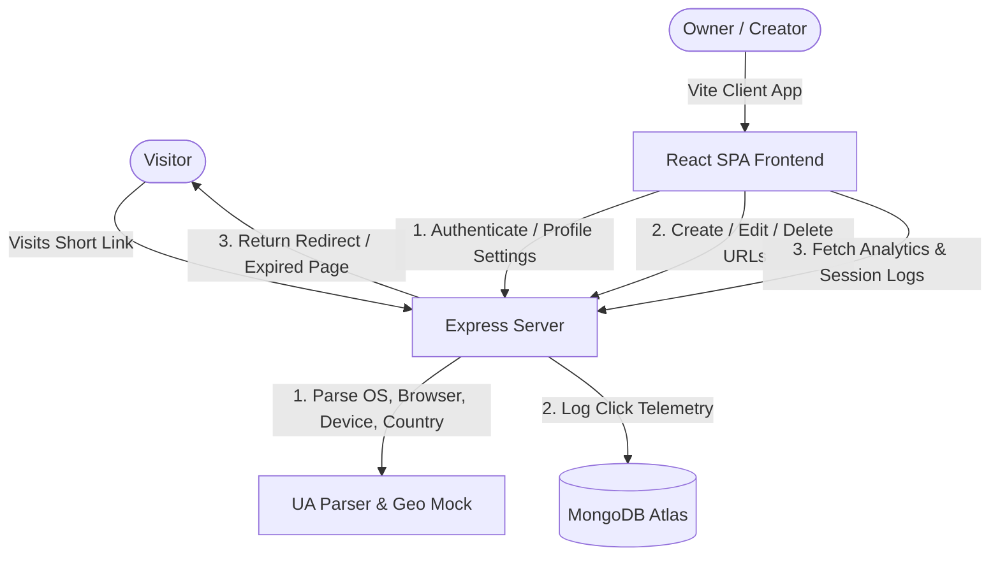

# LinkNova | Premium SaaS URL Shortener & Analytics

LinkNova is a production-ready, full-stack URL shortener and real-time performance analytics platform. Built with a premium white SaaS aesthetic (indigo brand accents, outfit/inter typography, clean grid cards, and micro-interactions), LinkNova offers a state-of-the-art alternative to traditional student projects.

---

## Features

- **Authentication**: JWT-based sign-in and registration with strong client/server-side validation and password strength estimation.
- **Dynamic URL Shortener**: Shorten links instantly with custom code alias overrides, short descriptions, and exact expiration settings.
- **Advanced Link Expiry**: Set specific date and time limits. Links expiring in <24h render ticking real-time countdown timers. Expired links serve premium white-themed error redirection notices.
- **Smart QR Code Toolbox**: Instantly render scannable codes. Supports file download, direct clipboard image copying (blob), and Web Share APIs.
- **Recharts Analytics Dashboard**: Monitor browser, device, referer, and country breakdowns. Toggle between daily (Area Chart), weekly (Line Chart), and monthly (Bar Chart) frequency trends.
- **Profile & Settings management**: Personal information edits, password changes, active session activity monitors, local data exporter (JSON file download), and complete account deletion workflows.
- **Bulk Import**: Drag-and-drop CSV parser to generate hundreds of links at once.

---

## Technical Architecture



---

## Setup Instructions

### Prerequisites
- Node.js (v18+)
- MongoDB running locally on `mongodb://127.0.0.1:27017/` (or a MongoDB Atlas URI)

### Local Installation
1. From the root directory, run the monorepo workspace installer:
   ```bash
   npm run install-all
   ```
2. Configure the environment variables in a `.env` file inside the `server/` directory:
   ```env
   PORT=5000
   MONGODB_URI=mongodb://127.0.0.1:27017/url-shortener
   JWT_SECRET=super_secret_url_shortener_jwt_key_2026_hackathon
   ```

### Execution
Start the Express server and Vite dev client concurrently:
```bash
npm run dev
```

- **Frontend App**: `http://localhost:5173/`
- **Backend Server / Redirector**: `http://localhost:5000/`

---

## API Documentation

### Authentication (`/api/auth`)
- `POST /register`: Register user (name, email, password, username).
- `POST /login`: Log in and retrieve JWT.
- `GET /me`: Fetch authenticated user profile details.
- `PUT /profile`: Update profile attributes (name, email, phone, company, timezone).
- `PUT /notifications`: Toggle notification preferences.
- `PUT /password`: Update credentials.
- `GET /sessions`: View active login session history.
- `DELETE /delete`: Terminate account and delete associated URLs.

### URL Operations (`/api/url`)
- `POST /shorten`: Generate short URL.
- `GET /`: Retrieve all shortened links created by user.
- `PUT /:id`: Update short URL configuration.
- `DELETE /:id`: Delete link.
- `GET /:id/analytics`: Aggregate detailed click statistics.
- `GET /public/analytics/:shortCode`: Aggregate shareable click statistics.
- `POST /bulk`: Bulk create shortened URLs from parsed CSV JSON payload.

---

## Deployment Guide

### Database (MongoDB Atlas)
1. Register on MongoDB Atlas and create a free Shared Cluster.
2. Under Network Access, allow access from anywhere (`0.0.0.0/0`).
3. Create a Database User and copy the Connection String URI.

### Backend (Render)
1. Create a Web Service on Render connected to your repository.
2. Set Build Command: `npm install` (in `server` root).
3. Set Start Command: `node src/index.js` (under `server` directory).
4. Configure Environment Variables: `MONGODB_URI` and `JWT_SECRET`.

### Frontend (Vercel)
1. Add a project in Vercel and connect your workspace.
2. Select `client` as the root directory.
3. Configure target build outputs to Vite and deploy.


[https://drive.google.com/file/d/1C3MVGYQqdzEELmj3_FZqPqPTb4_oNZJc/view?usp=sharing]

This project is a part of a hackathon run by https://katomaran.com
